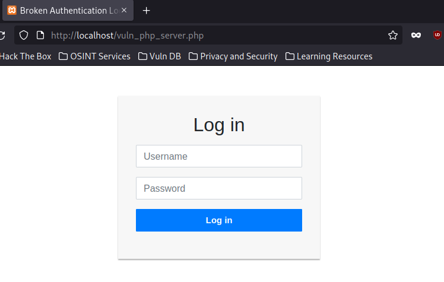
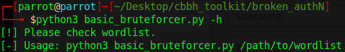

# Broken Authentication
- vuln_php_server.php can be hosted on XAMPP.

- basic_username_bruteforcer.py can be launched from an attack machine.

- rate_limit_check.py includes rate limiting logic

- vuln_php_ipcheck.php demonstrates how X-Forwarded can sometimes be used by developers to obtain the IP address of a user. Said IP address could perhaps be used for allowing accesses. This can be easily exploited by spoofing X-Forwarded IP address.
